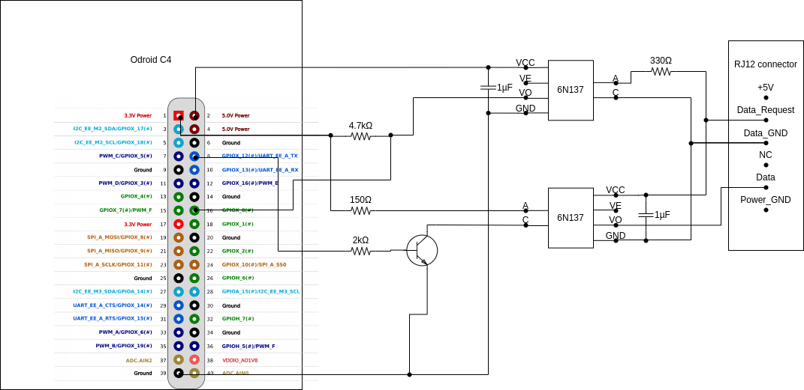
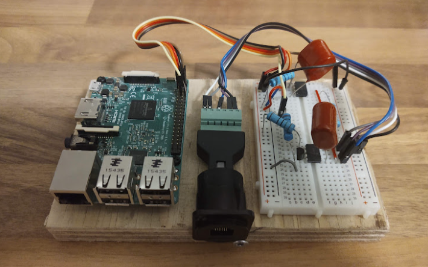

# p1gen

## Mission

At home, I have a charge point of Shell Recharge ([Home Advanced](https://shellrecharge.com/en-gb/home-charge-points/advanced)) to charge my electic car. This charge point has the following important features:
- RFID authentication with automatic reimbursment of electricity costs by employer
- Dynamic power management to avoid overloading the electricity grid connection

Unfortunately it lacks one other important feature:
- Integration with local energy production: as owner of a solar energy production installation, I would like my car to utilize as much as possible locally generated solar energy.

From hardware perspective, the charge point has the capability. After all, when the grid connection is close to getting overloaded, the dynamic power management feature succeeds in decreasing the charge speed. It lacks only the software to control the charge speed based on other parameters than just the difference between measured load and a statically configured maximum value.

The configured maximum value is really static: users don't have access to it. Only an official installer can set it during initial installation. If you want to change it later, e.g. when you upgrade your grid connection, you need to call support to change the configuration of the charge point.

So to get control over the charge speed, there is only one possbility left: we need to manipulate the charge point through the the dynamically measured load. So, the basic idea of this project is to fake those measurements, to let the dynamic power management feature do exactly what we want it to do. A simple example: if we don't want the charge point to charge the car at all, while the grid is far from being overloaded, we let the charge point falsely believe that our grid connection is already fully loaded and that there is no room for extra load.

The dynamic power management feature consists of (in my case at least):
- A small measurement module integrated in my fuse box ([Product sheet](https://xemex.eu/wp-content/uploads/2021/07/Product-Sheet-CSP1-1.0.pdf))
- A part in the charge point that acts upon the measurements emitted by this module.

The connection between this measurement module and the charge point is a simple serial cable with an RJ-11 connector and the data transferred over it follows the P1 protocol ([P1 Companion Standard](https://www.netbeheernederland.nl/_upload/Files/Slimme_meter_15_a727fce1f1.pdf)). The goal of this project is to replace that small measurement module with our own smarter device that generates the P1 protocol and hence control the charge point according to our needs.  

## Hardware

Wiring diagram of the device:


My original idea was to use an Odroid C4 device for this project, see diagram, but unfortunately I blew up the one that I bought. So I switched to an old Raspberry Pi Model 3B that I had left, which is also good enough. I kept the original wiring plan (not exactly the same pins of course but it maps 1-to-1), although with a Raspberry Pi it could probably be simplified a bit.
This is it:



## Set up environment

The software is written in C++, so it must be cross-compiled on a PC to run on ARM. To set up the environment for cross-compiling C++ applications to run on Raspberry Pi, I followed [the instructions of "Pieter P"](https://tttapa.github.io/Pages/Raspberry-Pi/C++-Development-RPiOS/).

This project depends on the boost library, so on your development PC:
```
sudo sbuild-apt rpi-bullseye-armhf apt-get install libboost-all-dev
```
and also on nlohmann::json. So make sure you have a local copy of [nlohmann/json.hpp](https://raw.githubusercontent.com/nlohmann/json/develop/single_include/nlohmann/json.hpp) in your include path.

If your environment is set up, it should be possible to build the application with
```
mkdir -p build && cd build
cmake .. -DCMAKE_TOOLCHAIN_FILE=../cmake/armv6-rpi-bullseye-gnueabihf2.cmake
make
```

Copy the p1gen binary and the public directory to the Raspberry Pi.

On the Raspberr Pi itself:
- /usr/lib/systemd/system/p1gen.service
- enable_uart=1 in /boot/config.txt
- apt install libboost-all?
- Something with libstdc++.so.6.0.31?

## Usage

- Config parameters?

## SW design

- How to add support for other inverters or any other source of energy context information?
- How to create new policies?
- How to test with simulator?

## Roadmap

- Scheduling support (already present in UI, not implemented yet)
- Android app (single full screen activity diplaying main web page?)
- Let TCP time out sooner (modbus connection to SMA)
- Get complete list of config parameters at runtime?
- Charging on single phase really not possible?
- Install script
- Auto-discover SMA inverter
- Auto-detect static parameters of SMA: maximum power inverter / battery
- Avoid accessing SD-card
- Service discovery: publish service
- Security
  - Use https
  - Every box has own unique private key, which is signed by own CA.
  - Own CA's certificate is listed as trust anchor in Android app.
  - Password is chosen on initial install and must be entered on later connections. Scenario:
    1. Android app connects to auto-discovered p1faker. 
    2. Is this the first time that an app connects to device?
       - Yes: Choose password
       - No: Enter password
       Thanks to the security config and SSL encryption, the app knows that it has a confidential channel to the p1faker and that the p1faker is really a p1faker (certificate signed by me :-) )
       So password can posted safely.
    3. Cookie received from p1faker so password doesn't need to be entered again.
    4. Safe re-connecting with cookie (stored in EncryptedSharedPreferences)
    
